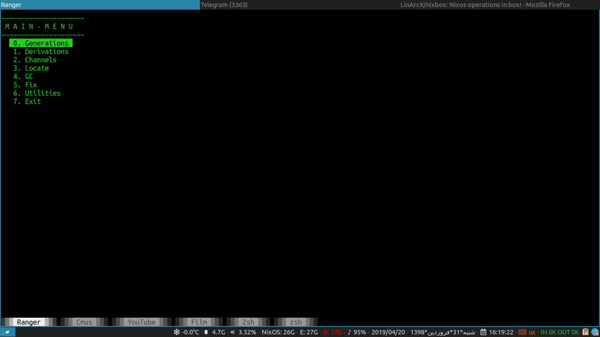

# NixBox   
Nixos operations in box!

## Preview

### Introduction
A menu driven shell script to manage nixos operations.

## Features
1. Show all information that user needs in Main Page.
2. Show Shell History in Graphical way in Scripts->Histogram.
3. You Can Change application fonts and theme via: Gnulium->Settings.

##
|About NixBox|Menu|search_derivation|
|:-----:|:-----:|:-----:|
||||
|Click image to enlarge|Click image to enlarge| Click image to enlarge|

## Installation

1. if you are on unstable channel:
`nix-env -iA nixos.nixbox`
2. or download __default.nix__ and build it with `nix-build`

## Contributing
 
1. Fork it!
2. Create your feature branch: `git checkout -b my-new-feature`
3. Commit your changes: `git commit -am 'Add some feature'`
4. Push to the branch: `git push origin my-new-feature`
5. Submit a pull request :D

## Bugs
 

Bugs should be reported [here](https://github.com/LinArcX/nixbox/issues) on the Github issues page.

## Credits
LinArcX
Github Repo:[https://github.com/LinArcX](https://github.com/LinArcX)

E-Mail:linarcx@gmail.com

## License

