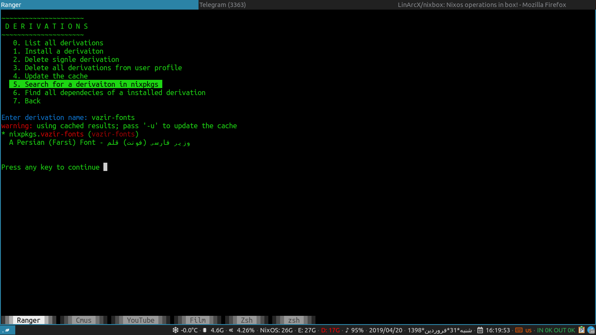
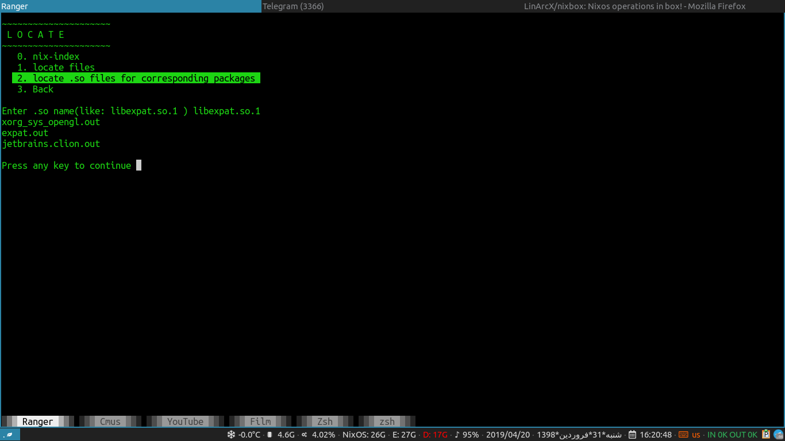

# NixBox   
Nixos operations in box!

## Preview

### Introduction
A menu driven shell script to manage nixos operations.

## Features
1. Show generations per profiles(user profile, system profile).
2. List/delete/search derivations.
3. List/update/add channels.

##
|Menu|Search Derivation|Locate Packages|
|:-----:|:-----:|:-----:|
||||
|Click image to enlarge|Click image to enlarge| Click image to enlarge|

## Installation

1. if you are in unstable channel:
`nix-env -iA nixos.nixbox`
2. or download __default.nix__ and build it with `nix-build`

## Donate
- Monero: `48VdRG9BNePEcrUr6Vx6sJeVz6EefGq5e2F5S9YV2eJtd5uAwjJ7Afn6YeVTWsw6XGS6mXueLywEea3fBPztUbre2Lhia7e`

## License

